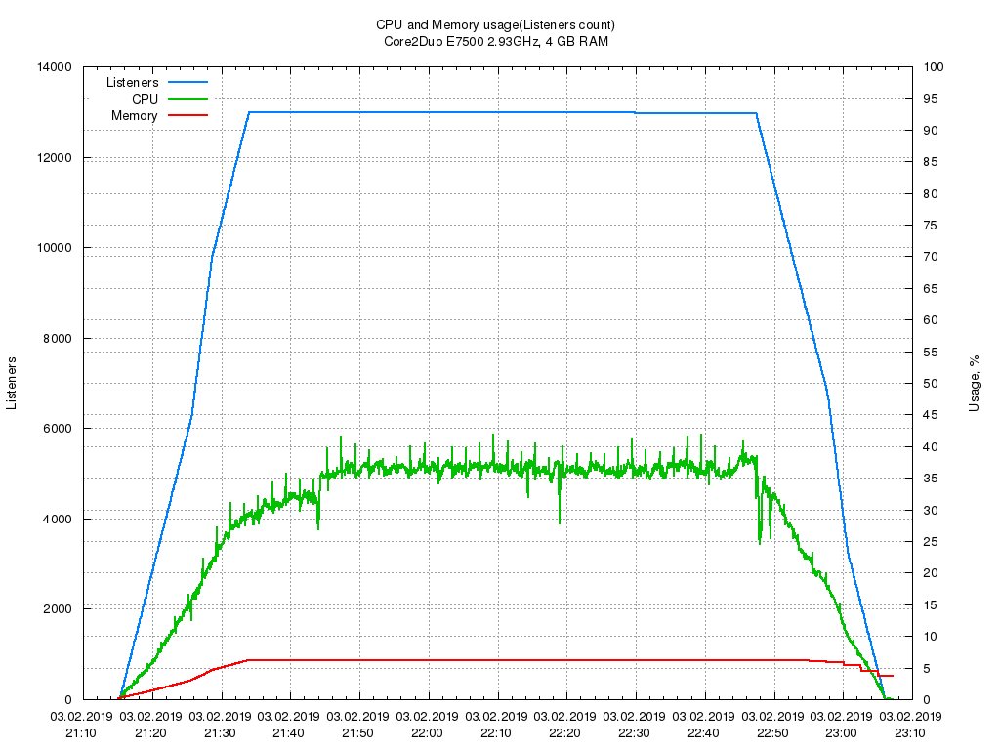

# PenguinCast

[](https://godoc.org/github.com/ssetin/PenguinCast)
[](https://travis-ci.org/ssetin/PenguinCast)
[](https://goreportcard.com/report/github.com/ssetin/PenguinCast)

IceCast compatible streaming audio server - server part of your internet radio station.

## Capabilities
* Receiving stream from Source and sending it to Clients
* Operating with ShoutCast metadata
* Collecting and saving listening statistics to access.log file
* Html and json endpoints for accessing server status (__http://host:port/info.html__ and __http://host:port/info.json__)
* Real time server state monitoring (__http://host:port/monitor.html__)
* Configuring by YAML

## Configuring
Configuration parameters are stored in config.yaml.

```yaml
Name: Rollstation radio
Admin: admin@site.com
Location: Saint Petersburg
Host: 127.0.0.1
Socket:
  Port: 8008

Limits:
  Clients: 100000
  Sources: 5
  SourceIdleTimeOut: 10
  EmptyBufferIdleTimeOut: 5
  WriteTimeOut: 10

Auth:
  AdminPassword: admin

Paths:
  Log: log/
  Web: html/

Logging:
  LogLevel: 2
  LogSize: 50000
  UseMonitor: true
  MonitorInterval: 5
  UseStat: true
  StatInterval: 5

Mounts:
  - Name: RockRadio96
    User: admin
    Password: admin
    Genre: Rock
    Description: Rock radio station, Saint Petersburg
    BitRate: 96
    BurstSize: 65535
    DumpFile: ''
```

#### Socket
- Port - the TCP port that will be used to accept client connections

#### Limits
- Clients - maximum clients per server
- Sources - maximum Sources per server
- SourceIdleTimeOut - data timeout for source
- EmptyBufferIdleTimeOut - silence timeout for client
- WriteTimeOut - timeout for writing data to client connection

#### Mounts
- Name - required, mount point name
- User - required, user name for source
- Password - required, password for source
- Genre - optional, Genre
- Description - optional, stream description
- BitRate - optional, stream bitrate
- BurstSize - number of bytes to collect before send to client on start streaming
- DumpFile - optional, detect filename in which audio data from source will be stored

#### Logging
- Loglevel - determine what will be stored in error.log 
    - 1 - Errors
    - 2 - Warning
    - 3 - Info
    - 4 - Debug
- UseMonitor - activate online monitoring of server state
- MonitorInterval - monitor updating interval, sec
- UseStat - collect and save listeners count, cpu and memory usage to file log/stat.log
- StatInterval - statistics collection interval, sec


## Load testing
I did'nt have a goal to measure the maximum number of listeners, but only to look at the overall picture of working server. The server has been tested for CPU and memory usage. For testing i used a simplified version of the client, which connects to the server and writes the resulting stream to files (first 30 listeners). Two test scripts was launched on two machines and create a new connections every 5 seconds until the number of listeners is not reached 13 thousand. Each connection listened the stream for 1:30 hour and then shuted down. Meanwhile, CPU and memory usage statistics collection has been enabled on PenguinCast and based on these data the following chart was constructed. After the test was completed, the resulting dump files were tested by mp3check for errors.

Radio server was broadcasting 96 Kb/s mp3 stream and also acted as listeners generator.  

Server: Core2Duo E7500 2.93GHz, 4 GB RAM, Ubuntu Desktop 18.04  
Another listeners generator: Intel Celeron(R) G540 2.50GHz, 1GB RAM, Ubuntu Server 18.04  
All machines placed in gigabit local network.  

